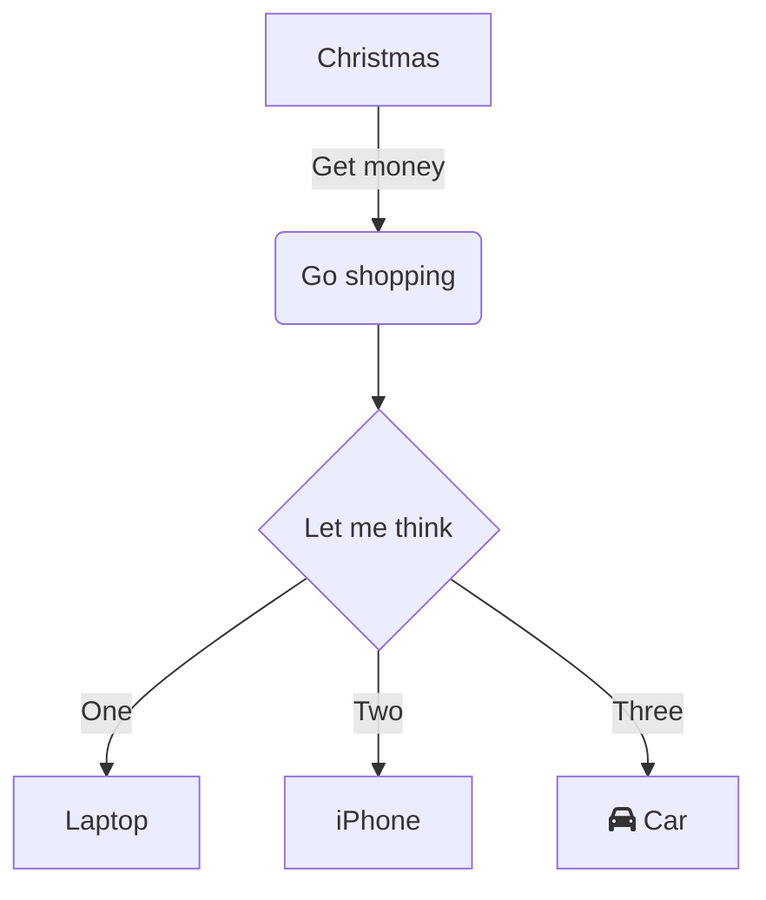
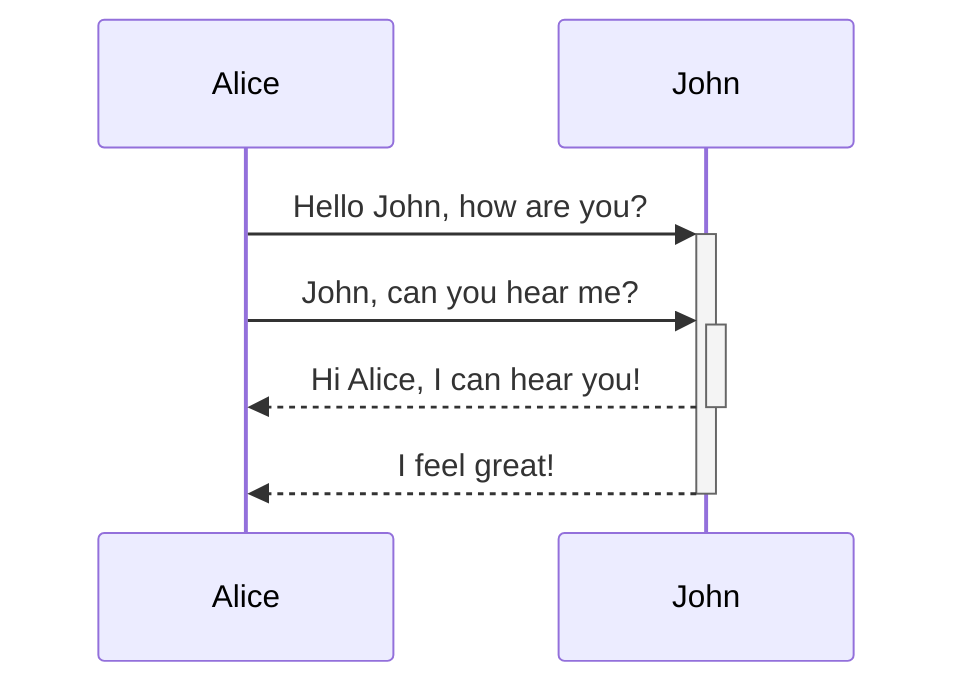
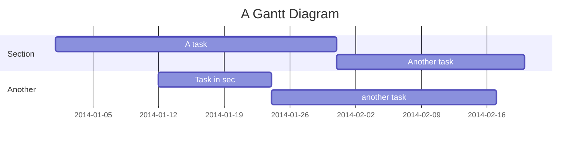
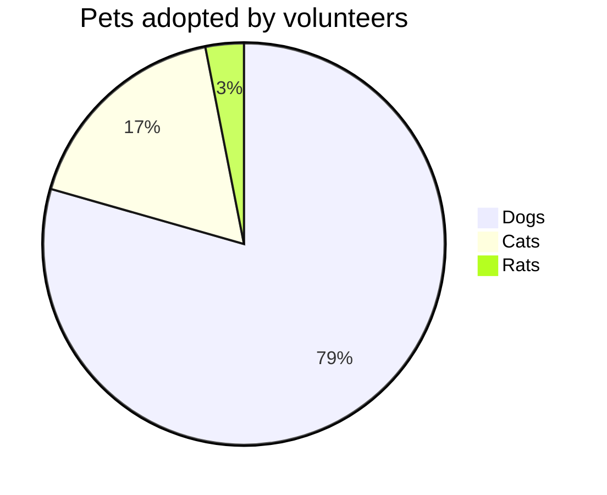
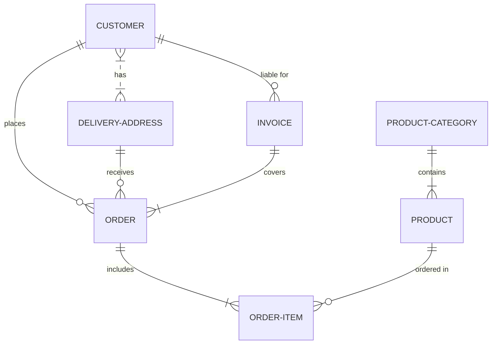

这是一个 demo，在这里写入博文正文。博文遵循 markdown 语法，支持 mermaid 作图。

# markdown 语法

# h1 标题
## h2 标题
### h3 标题
#### h4 标题
##### h5 标题
###### h6 标题


## 水平线

___

---

***


## 文本样式

**This is bold text**

__This is bold text__

*This is italic text*

_This is italic text_

~~Strikethrough~~


## 列表

无序

+ Create a list by starting a line with `+`, `-`, or `*`
+ Sub-lists are made by indenting 2 spaces:
  - Marker character change forces new list start:
    * Ac tristique libero volutpat at
    + Facilisis in pretium nisl aliquet
    - Nulla volutpat aliquam velit
+ Very easy!

有序

1. Lorem ipsum dolor sit amet
2. Consectetur adipiscing elit
3. Integer molestie lorem at massa


1. You can use sequential numbers...
1. ...or keep all the numbers as `1.`

Start numbering with offset:

57. foo
1. bar


## 代码

Inline `code`

Indented code

    // Some comments
    line 1 of code
    line 2 of code
    line 3 of code


Block code "fences"

```
Sample text here...
```

Syntax highlighting

```javascript
var foo = function (bar) {
  return bar++;
};

console.log(foo(5));
```


# mermaid 语法

[点击查看全部 mermaid 语法 demo]: https://mermaid-js.github.io/mermaid-live-editor

1. 流程图



2. 时序图



3. 甘特图



4. 饼图



5. ER 图


