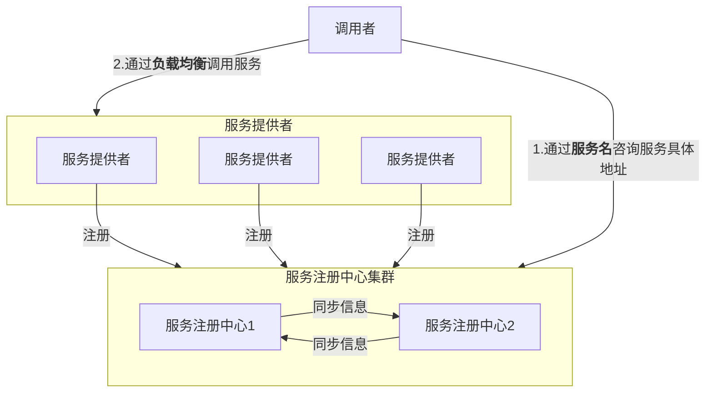

# Spring-Cloud 微服务学习日志

[TOC]

## 各种概念

### 服务发现
服务发现有三个角色，服务提供者、服务消费者和服务中介。
服务中介是联系服务提供者和服务消费者的桥梁。
服务提供者将自己提供的服务地址注册到服务中介，服务消费者从服务中介那里查找自己想要的服务的地址，然后享受这个服务。
服务中介提供多个服务，每个服务对应多个服务提供者。

### 配置管理
在统一的地方管理配置文件。
通过 svn、git 或控制台管理配置文件

### 服务网关

### 服务远程调用

### 服务熔断

### 负载均衡

