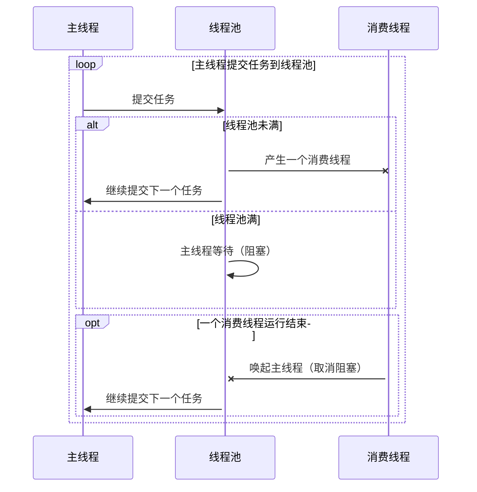

###  原理

利用队列、线程池、锁 实现一个规定最大线程数的线程池。

主线程即任务生产线程，消费线程则是连接池中的线程。


### 图解




### 使用

```java

    public static void main(String[] args) {
        // 定义一个最大线程数为 3 的池
        final TaskRunner taskRunner = new TaskRunner(3);
        for (int i = 0; i < 10; i++) {
            int finalI = i;
            taskRunner.runTask(() -> {
                try {
                    Thread.sleep(1000);
                } catch (InterruptedException e) {
                    e.printStackTrace();
                }
                System.out.println(finalI);
            });
            System.out.println("commit: " + i);
        }
    }
```


### 代码

```java
package com.ric;

import java.io.Closeable;
import java.util.concurrent.LinkedBlockingQueue;
import java.util.concurrent.RejectedExecutionException;
import java.util.concurrent.ThreadPoolExecutor;
import java.util.concurrent.TimeUnit;

/**
 * @author Ric
 * @date 2019/1/7 10:58
 */
public class TaskRunner implements Closeable {
    private final ThreadPoolExecutor executor;
    private final Object lock = new Object();

    public TaskRunner(int poolSize) {
        LinkedBlockingQueue queue = new LinkedBlockingQueue<Runnable>(poolSize);
        // 定义初始容量为最大容量的一半
        executor = new ThreadPoolExecutor(Math.min(1, poolSize / 2), poolSize, 200, TimeUnit.MILLISECONDS, queue);
    }

    @Override
    public void close() {
        executor.shutdown();
    }

    /**
     * 任务数量达到规定的最大值则会阻塞
     * @author Ric
     * @date 2019/4/10
     * @param task
     * @return void
     **/
    public void runTask(Runnable task) {
        try {
            executor.execute(() -> {
                try {
                    task.run();
                } finally {
                    synchronized (lock) {
                        // 唤起线程
                        lock.notify();
                        if (executor.getTaskCount() - executor.getCompletedTaskCount() == 1) {
                            System.out.println("最后一个任务已完成，可以关闭连接池");
                            close();
                        }
                    }
                }
            });
        } catch (RejectedExecutionException e) {
            // 提交被拒绝，则等待（阻塞线程）
            try {
                synchronized (lock) {
                    lock.wait();
                }
                runTask(task);
            } catch (InterruptedException e1) {
                // 线程中断,调用 thread 的 Interrupted 方法时触发.此处不会发生
                e1.printStackTrace();
            }
        }
    }
}

```

