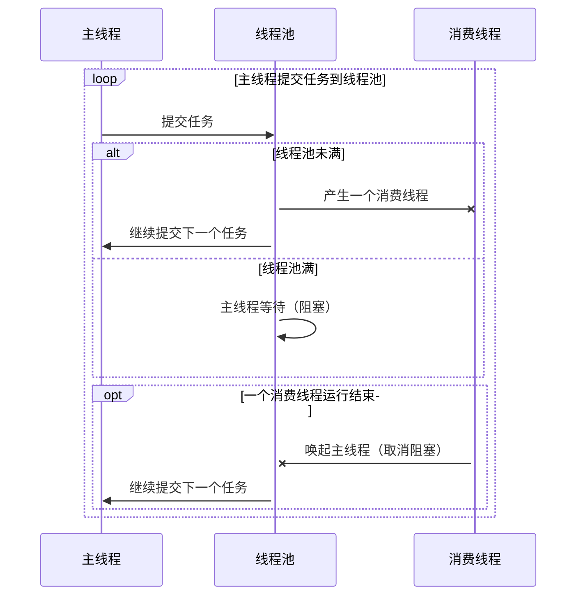

###  原理

利用队列、线程池、锁 实现一个规定最大线程数的线程池。

主线程即任务生产线程，消费线程则是连接池中的线程。

增加任务超时设置

增加可自动关闭设置


### 图解




### 使用

```java

    public static void main(String[] args) {
        // 定义一个最大线程数为 3 的池任务执行完自动关闭
        final TaskRunner taskRunner = new TaskRunner(3, true);
        for (int i = 0; i < 10; i++) {
            int finalI = i;
            taskRunner.runTask(() -> {
                try {
                    Thread.sleep(1000);
                } catch (InterruptedException e) {
                    e.printStackTrace();
                }
                System.out.println(finalI);
            }, 2); // 2秒后超时
            System.out.println("commit: " + i);
        }
    }
```


### 代码

```java
package ric2cn.tool.program;

import java.io.Closeable;
import java.util.concurrent.*;

/**
 * @author Ric
 * @date 2019/1/7 10:58
 */
public class TaskRunner implements Closeable {
    private ExecutorService executor;
    private final Object lock = new Object();
    private final int poolSize;
    private int currentSize;
    private boolean autoClose;
    private boolean submitting;

    public TaskRunner(int poolSize) {
        this(poolSize, false);
    }

    public TaskRunner(int poolSize, boolean autoClose) {
        this.poolSize = poolSize;
        this.autoClose = autoClose;
        init();
    }

    private void init() {
        executor = Executors.newCachedThreadPool();
    }

    /**
     * 任务数量达到规定的最大值则会阻塞
     *
     * @param task
     * @return void
     * @author Ric
     * @date 2019/4/10
     **/
    public void runTask(Task task) {
        try {
            checkAndbocking();
        } catch (InterruptedException e) {
            return;
        }
        executor.submit(() -> {
            try {
                task.run();
            } catch (Throwable throwable) {
                System.err.println(throwable.getMessage());
            } finally {
                synchronized (lock) {
                    currentSize--;
                    if (!autoClose || submitting || currentSize > 0) {
                        lock.notify();
                    } else {
                        close();
                    }
                }
            }
        });
    }

    @Override
    public void close() {
        executor.shutdown();
    }

    /**
     * 任务数量达到规定的最大值则会阻塞
     *
     * @param task
     * @param timeout 超时时长，单位为秒
     * @return void
     * @author Ric
     * @date 2019/4/10
     **/
    public void runTask(CancelableTask task, long timeout) {
        try {
            checkAndbocking();
        } catch (InterruptedException e) {
            return;
        }
        final Future<?> submit = executor.submit(() -> {
            try {
                task.run();
            } catch (Throwable throwable) {
                System.err.println(throwable.getMessage());
                throwable.printStackTrace();
            } finally {
                synchronized (lock) {
                    currentSize--;
                    if (!autoClose || submitting || currentSize > 0) {
                        lock.notify();
                    } else {
                        close();
                    }
                }
            }
        });
        if (timeout > 0) {
            executor.submit(() -> {
                try {
                    submit.get(timeout, TimeUnit.SECONDS);
                } catch (Exception e) {
                    e.printStackTrace();
                    if (!submit.isCancelled()) {
                        task.cancel();
                        submit.cancel(true);
                    }
                }
            });
        }
    }

    private void checkAndbocking() throws InterruptedException {
        submitting = true;
        synchronized (lock) {
            if (executor.isShutdown()) {
                init();
            }
            while (currentSize >= poolSize) {
                try {
                    lock.wait();
                } finally {
                    submitting = false;
                }
            }
            currentSize++;
        }
        submitting = false;
    }

    public interface Task {
        void run() throws Throwable;
    }

    public interface CancelableTask extends Task {
        void cancel();
    }
}

```

